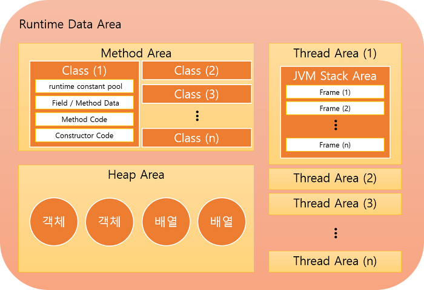

# Java 데이터 타입과 메모리 영역

## Java 데이터 타입의 분류

프로그램은 자료구조(데이터)와 알고리즘의 결합으로 이루어진다.	
Java의 데이터 타입은 **기본 타입**과 **참조 타입**으로 분류된다.

### 1. 기본 타입

```java
// 기본 데이터 타입
byte b = 1;
char c = 'a'					// 한 글자
int i = 1000;					// 정수 리터럴

float f = 3.14f;
double	d = 3.141592;			// 실수 리터럴

// Overflow
int i3 = (int)1000000000000l;
System.out.println(i3);			// -727379968 
```

1. 정수 리터럴
	- byte : 1byte 8bit
	- char : 2byte 16bit
	- short : 2byte 16bit
	- **int** : 4byte 32bit
		> 정수 기본값
	- long : 8byte 64bit

2. 실수 리터럴
	- float : 4byte 16bit
	- **double** : 8byte 64bit
		> 실수 기본값

3. 논리 리터럴
	- boolean : 1byte 8bit
		> true, false

**기본 데이터 타입이란 정수, 실수, 문자, 논리 리터럴을 직접 저장하는 타입을 말한다.**
> 리터럴은 직접 입력된 값을 말한다	

메모리는 최소 기억 단위인 **bit**, 8개 bit를 묶은 **byte**가 있다.	
**오버플로우 현상**은 데이터 타입의 값의 범위를 초과할 때 발생하는 현상으로 엉뚱한 값이 변수에 들어가게 된다.

#### 타입 변환

```java
int i2 = 'A';			
System.out.println(i2); 		// 97 묵시적 형변환
System.out.println((char)i2);	// 'A' 명시적 형변환
```

타입 변환은 컴파일러가 자동으로 하는 **묵시적 형변환**과 직접 변환 시키는 **명시적 형변환**이 있다.		
- 묵시적 형변환 : 작은 메모리 타입을 큰 메모리 타입으로 컴파일러가 알아서 변환해준다.		
- 명시적 형변환 : 큰 메모리 타입을 작은 메모리 타입으로 직접 변환시키는 것으로 **데이터 소실**이 생긴다.


### 2. 참조 타입과 참조 변수

```java
String name = "2sian";		// 문자열 리터럴
int[] arr = new arr[3];		// int 값을 가지는 3자리 배열 

class Car {					// 클래스
	int wheel = 4;			// 인스턴스 변수
}

Car a = new Car();			// Car 타입의 a 인스턴스 (객체) 생성
a.wheel = 6;				// Car a의 변수 값을 변경
Car b;						// new 할당자가 없어도 Car 참조할 수 있음
b = a;						// Car b가 Car a를 참조

System.out.println(a.wheel);// 6
System.out.println(b.wheel);// 6
```

**참조 타입**은 객체의 주소를 참조하는 타입으로 **배열, 열거, 클래스, 인터페이스 타입**등 기본 타입을 제외한 모든 타입을 말한다.	
기본 타입으로 선언한 변수는 **값**을 저장하지만 참조 타입으로 선언한 변수는 메모리에 **주소**를 값으로 가진다.	
기본 타입은 **Stack** 영역에 생성되고 참조 타입은 **Heap**영역에 생성된다.

#### String

```java
String name = "white";
String name1 = name;
String name2 = new String("white");

System.out.println(name == name1);	// true		같은 객체를 참조
System.out.println(name == name2);	// false	이름은 같지만 참조하는 객체가 다름
```

**String**은 참조형 변수로 타입이 아닌 String 클래스가 적혀있다.	
문자열이 직접 변수에 저장되는 것이 아니라 String 객체로 생성되고 변수는 String 객체를 참조하기 때문이다.

## 메모리 사용 영역

**JVM**은 OS에서 할당받은 메모리 영역을 **메서드 영역, 스레드 영역, 힙 영역**과 같이 세부 영역으로 구분해서 사용한다.



### 1. 메서드 영역 (Method Area)

메서드 영역에는 코드에서 사용되는 클래스 별로 런타임 상수 풀, 필드 / 메서드 데이터, 메서드 코드, 생성자 코드 등을 분류해서 저장한다.		
메서드 영역은 JVM이 시작될 때 모든 스레드가 공유하는 영역이다.

### 2. 힙 영역 (Heap Area)

힙 영역은 객체와 배열이 생성되는 영역으로 JVM 스택 영역의 변수나 다른 객체의 필드를 참조한다.	
> 참조하는 변수나 필드가 없다면 쓰레기 값으로 취급하여 제거된다

### 3. 스택 영역 (Stack Area)

스택 영역은 각 스레드마다 하나씩 존재하며 스레드가 시작될 때 할당된다.	
스택은 메서드를 호출할 때마다 프레임을 추가하고 메서드가 종료되면 해당 프레임을 제거한다.
