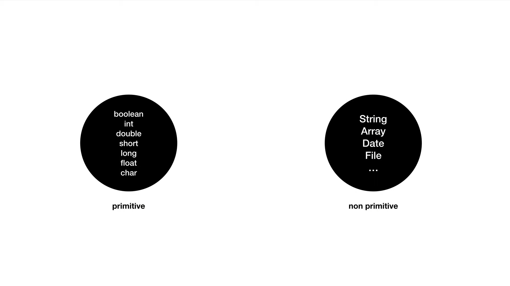
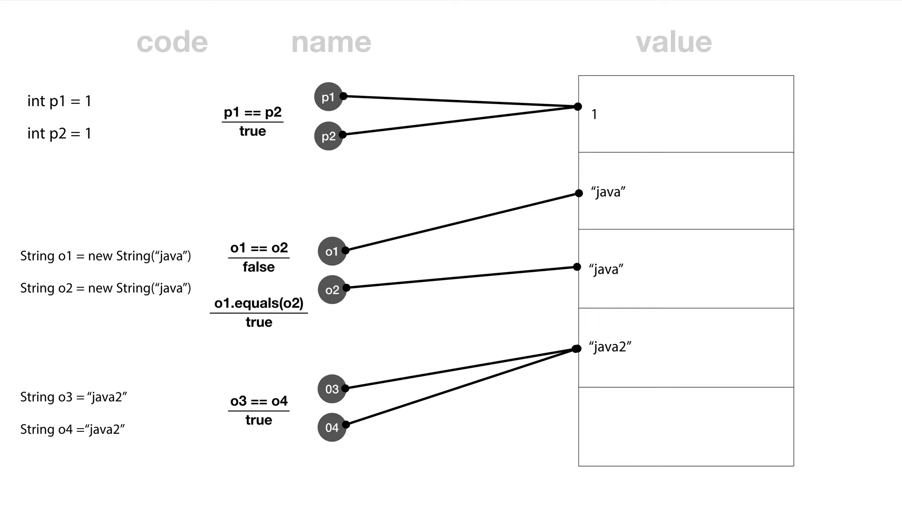

# 조건문

```java
public class IfApp {
 
    public static void main(String[] args) {
 
        boolean sunny = false;
        boolean cloudy = true;

        if(sunny){
            System.out.println("날씨 좋다"); // sunny가 false 이므로 넘어간다
        } else if(cloudy) {
            System.out.println("우중충하네"); // cloudy가 true 이므로 실행한다
        } else {
            System.out.println("나가지 말자");
        }
 
    }
 
}
```
- `if문`은 참과 거짓을 판단하여 코드를 실행한다

```java
public class AuthApp {

	public static void main(String[] args) {
		String id = "2Sian";
		String[] idArray = { "2Sian" };
		String inputId = idArray[0];

		String pwd = "1234";
		String[] pwdArray = { "1234" };
		String inputPwd = pwdArray[0];

		System.out.println("Hi. ");

//		if(inputId == id) {
		if (inputId.equals(id) && inputPwd.equals(pwd)) {
			System.out.println("Master!");
		} else {
			System.out.println("Who are you?");
		}
	}

}
```

- `&&`은 논리 연산자로 `and`를 뜻하며 조건이 모두 만족하면 `true`

## 문자의 비교


>출처 : 생활코딩(https://opentutorials.org/)

자바의 데이터 타입은 `primitive(원시)`와 `non primitive`로 나누어진다 

- **primitive** : 더 이상 쪼갤 수 없는 데이터
- **non primitive** : String, Array, Object 등 원시 데이터 타입이 아닌 것들


>출처 : 생활코딩(https://opentutorials.org/)

- `p1 == p2`는 같은 곳에 있는 데이터를 가리킨다는 의미
- `new String("java")` 식으로 새로운 문자열을 만든다면 다른 곳에 새로운 데이터를 생성하게 된다
- 비원시 데이터타입은 `equals()`라는 메서드로 내용이 같은 지를 판단한다
- `new`를 사용하지 않고 문자열을 만들면 마치 원시 데이터 타입처럼 동작하게 된다