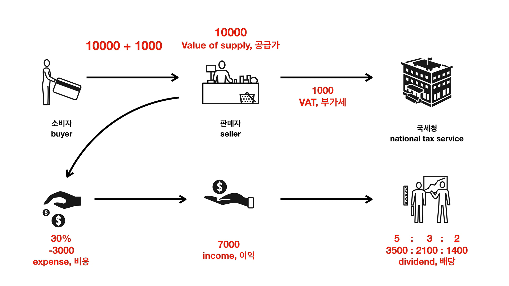

# OpenTutorial App

## 구상


>출처 : 생활코딩(https://opentutorials.org/)

판매자로서 무언가를 팔고 세금, 기타 비용등을 제하고 남은 이익을 동업자와 배분하는 상황 가정

## 프로그래밍

```java
public class AccountingApp
{

    public static void main(String[] args)
    {
        System.out.println("Value of supply : " + 10000.0);
        System.out.println("VAT : " + (10000.0 * 0.1));
        System.out.println("Total : " + (10000.0 + 10000.0 * 0.1));
        System.out.println("Expense : " + (10000.0 * 0.3));
        System.out.println("Income : " + (10000.0 - 10000.0 * 0.3));
        System.out.println("Devidend 1 : " + (10000.0 - 10000.0 * 0.3) * 0.5);
        System.out.println("Devidend 2 : " + (10000.0 - 10000.0 * 0.3) * 0.3);
        System.out.println("Devidend 3 : " + (10000.0 - 10000.0 * 0.3) * 0.2);
    }

}
```

- 어떠한 동작을 시간에 순서에 따라 실행되도록 작성

## 변수화

```java

public class AccountingApp
{

    public static void main(String[] args)
    {
        double valueOfSupply = Double.parseDouble(args[0]); // 물건의 가격을 인자로 받아오기
        double vatRate = 0.1;
        double expenseRate = 0.3;
        double vat = valueOfSupply * vatRate;
        double total = valueOfSupply + vat;
        double expense = valueOfSupply * expenseRate;
        double income = valueOfSupply - expense;
        double dividend1 = income * 0.5;
        double dividend2 = income * 0.3;
        double dividend3 = income * 0.2;
 
        System.out.println("Value of supply : " + valueOfSupply);
        System.out.println("VAT : " + vat);
        System.out.println("Total : " + total);
        System.out.println("Expense : " + expense);
        System.out.println("Income : " + income);
        System.out.println("Dividend 1 : " + dividend1);
        System.out.println("Dividend 2 : " + dividend2);
        System.out.println("Dividend 3 : " + dividend3);
    }

}
```

- 동일한 코드를 `변수`로 지정해 `데이터가 변할 때마다 새로 작성하는 수고`를 줄임
- 깔끔하고 간결한 코드는 덤

## 조건문

```java

public class AccountingIfApp
{

    public static void main(String[] args)
    {
        double valueOfSupply = Double.parseDouble(args[0]);
        double vatRate = 0.1;
        double expenseRate = 0.3;
        double vat = valueOfSupply * vatRate;
        double total = valueOfSupply + vat;
        double expense = valueOfSupply * expenseRate;
        double income = valueOfSupply - expense;

        double dividend1;
        double dividend2;
        double dividend3;

        // 조건문
        // 참이면 if문 다음의 코드 실행 / 거짓이면 else문 다음의 코드 실행
        if (income > 10000.0)
        {
            dividend1 = income * 0.5;
            dividend2 = income * 0.3;
            dividend3 = income * 0.2;
        } else
        {
            dividend1 = income * 1.0;
            dividend2 = income * 0;
            dividend3 = income * 0.2;
        }

        System.out.println("Value of supply : " + valueOfSupply);
        System.out.println("VAT : " + vat);
        System.out.println("Total : " + total);
        System.out.println("Expense : " + expense);
        System.out.println("Income : " + income);
        System.out.println("Dividend 1 : " + dividend1);
        System.out.println("Dividend 2 : " + dividend2);
        System.out.println("Dividend 3 : " + dividend3);
    }

}
```

## 배열

```java
public class AccountingArrayApp
{

    public static void main(String[] args)
    {
        double valueOfSupply = Double.parseDouble(args[0]);
        double vatRate = 0.1;
        double expenseRate = 0.3;
        double vat = valueOfSupply * vatRate;
        double total = valueOfSupply + vat;
        double expense = valueOfSupply * expenseRate;
        double income = valueOfSupply - expense;
        
        // double형 데이터만 들어가는 배열
        double[] dividendRates = new double[3];
        dividendRates[0] = 0.5;
        dividendRates[1] = 0.3;
        dividendRates[2] = 0.2;

        double dividend1 = income * dividendRates[0];
        double dividend2 = income * dividendRates[1];
        double dividend3 = income * dividendRates[2];

        System.out.println("Value of supply : " + valueOfSupply);
        System.out.println("VAT : " + vat);
        System.out.println("Total : " + total);
        System.out.println("Expense : " + expense);
        System.out.println("Income : " + income);
        System.out.println("Dividend 1 : " + dividend1);
        System.out.println("Dividend 2 : " + dividend2);
        System.out.println("Dividend 3 : " + dividend3);
    }

}
```

## 반복문

```java
public class AccountingArrayLoopApp
{

    public static void main(String[] args)
    {
        double valueOfSupply = Double.parseDouble(args[0]);
        double vatRate = 0.1;
        double expenseRate = 0.3;
        double vat = valueOfSupply * vatRate;
        double total = valueOfSupply + vat;
        double expense = valueOfSupply * expenseRate;
        double income = valueOfSupply - expense;

        System.out.println("Value of supply : " + valueOfSupply);
        System.out.println("VAT : " + vat);
        System.out.println("Total : " + total);
        System.out.println("Expense : " + expense);
        System.out.println("Income : " + income);

        // 반복문은 배열과 함께 쓰는 경우가 많음
        double[] dividendRates = new double[3];
        dividendRates[0] = 0.5;
        dividendRates[1] = 0.3;
        dividendRates[2] = 0.2;

        // 배열의 길이만큼 반복
        int i = 0;
        while (i < dividendRates.length)
        {
            System.out.println("Dividend 1 : " + (income * dividendRates[i]));
            i = i + 1;
        }

    }

}
```

## 메서드

```java

public class AccountingMethodApp
{
    // 전역 변수 설정
    public static double valueOfSupply;
    public static double vatRate;
    public static double expenseRate;

    public static void main(String[] args)
    {
        valueOfSupply = 10000.0;
        vatRate = 0.1;
        expenseRate = 0.3;

        print();
    }

    // 메서드
    public static void print()
    {
        System.out.println("Value of supply : " + valueOfSupply);
        System.out.println("VAT : " + getVAT());
        System.out.println("Total : " + getTotal());
        System.out.println("Expense : " + getExpense());
        System.out.println("Income : " + getIncome());
        System.out.println("Dividend 1 : " + getDividend1());
        System.out.println("Dividend 2 : " + getDividend2());
        System.out.println("Dividend 3 : " + getDividend3());
    }

    public static double getDividend3()
    {
        return getIncome() * 0.2;
    }

    public static double getDividend2()
    {
        return getIncome() * 0.3;
    }

    public static double getDividend1()
    {
        return getIncome() * 0.5;
    }

    public static double getIncome()
    {
        return valueOfSupply - getExpense();
    }

    public static double getExpense()
    {
        return valueOfSupply * expenseRate;
    }

    public static double getTotal()
    {
        return valueOfSupply + getVAT();
    }

    public static double getVAT()
    {
        return valueOfSupply * vatRate;
    }

}
```

- 자바의 `메서드`는 `클래스 내부에만 존재`하는 `함수`이다
- 똑같은 내용을 반복할 때 `메서드`를 사용한다
- `어떠한 입력값을 넣었을 때 어떤 리턴값을 돌려준다`라는 식으로 작성한다

## 클래스

```java
// 클래스로 그룹핑
class Accounting
{
    public static double valueOfSupply;
    public static double vatRate;
    public static double expenseRate;

    public static void print()
    {
        System.out.println("Value of supply : " + valueOfSupply);
        System.out.println("VAT : " + getVAT());
        System.out.println("Total : " + getTotal());
        System.out.println("Expense : " + getExpense());
        System.out.println("Income : " + getIncome());
        System.out.println("Dividend 1 : " + getDividend1());
        System.out.println("Dividend 2 : " + getDividend2());
        System.out.println("Dividend 3 : " + getDividend3());
    }

    public static double getDividend3()
    {
        return getIncome() * 0.2;
    }

    public static double getDividend2()
    {
        return getIncome() * 0.3;
    }

    public static double getDividend1()
    {
        return getIncome() * 0.5;
    }

    public static double getIncome()
    {
        return valueOfSupply - getExpense();
    }

    public static double getExpense()
    {
        return valueOfSupply * expenseRate;
    }

    public static double getTotal()
    {
        return valueOfSupply + getVAT();
    }

    public static double getVAT()
    {
        return valueOfSupply * vatRate;
    }

}

public class AccountingClassApp
{

    public static void main(String[] args)
    {
        // 다른 클래스에서 가져오기
        Accounting.valueOfSupply = 10000.0;
        Accounting.vatRate = 0.1;
        Accounting.expenseRate = 0.3;

        Accounting.print();
    }

}
```

- `클래스`는 `서로 연관된 변수와 메서드를 그룹핑`한 것이다
- `소속을 명시적`으로 표현할 수 있다
- `클래스가 다르다면` 같은 이름의 메서드도 사용할 수 있다

## 인스턴스

```java
class Accounting
{
    // static 제거
    public double valueOfSupply;
    public double vatRate;
    public double expenseRate;

    public void print()
    {
        System.out.println("Value of supply : " + valueOfSupply);
        System.out.println("VAT : " + getVAT());
        System.out.println("Total : " + getTotal());
        System.out.println("Expense : " + getExpense());
        System.out.println("Income : " + getIncome());
        System.out.println("Dividend 1 : " + getDividend1());
        System.out.println("Dividend 2 : " + getDividend2());
        System.out.println("Dividend 3 : " + getDividend3());
    }

    public double getDividend3()
    {
        return getIncome() * 0.2;
    }

    public double getDividend2()
    {
        return getIncome() * 0.3;
    }

    public double getDividend1()
    {
        return getIncome() * 0.5;
    }

    public double getIncome()
    {
        return valueOfSupply - getExpense();
    }

    public double getExpense()
    {
        return valueOfSupply * expenseRate;
    }

    public double getTotal()
    {
        return valueOfSupply + getVAT();
    }

    public double getVAT()
    {
        return valueOfSupply * vatRate;
    }

}

public class AccountingClassApp
{

    public static void main(String[] args)
    {

        // 인스턴스
        Accounting a1 = new Accounting();
        a1.valueOfSupply = 20000.0;
        a1.vatRate = 0.2;
        a1.expenseRate = 0.5;
        a1.print();

        Accounting a2 = new Accounting();
        a2.valueOfSupply = 20000.0;
        a2.vatRate = 0.2;
        a2.expenseRate = 0.5;
        a2.print();

    }

}

```

- `인스턴스`는 `클래스를 복제하여 같은 메서드에 다른 상태를 갖도록`한 것이다
- `new` 키워드로 복제할 수 있다
- 복제된 클래스로 더 편리하게 작업할 수 있다
