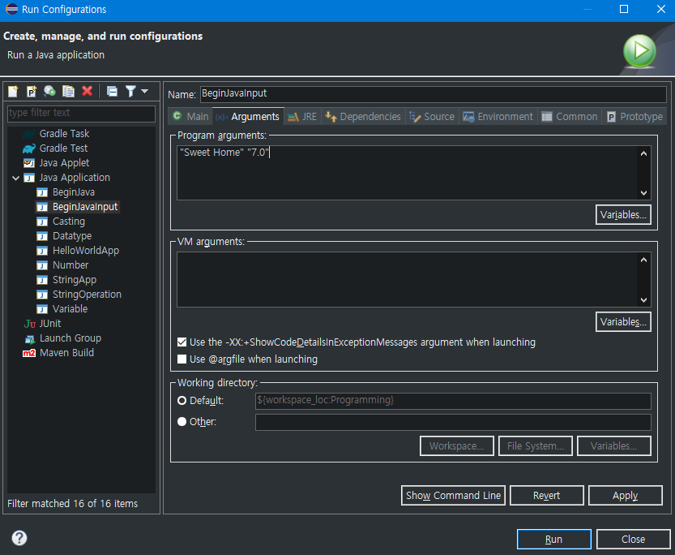
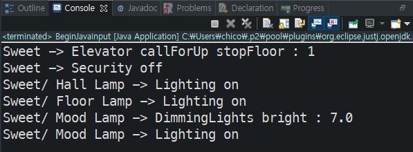

# Programming Practice

```java
import org.opentutorials.iot.Elevator;
import org.opentutorials.iot.Lighting;
import org.opentutorials.iot.Security;

public class BeginJava
{

	public static void main(String[] args)
	{
		String id = "SWEET HOME 201";

		// Elevator Call
		Elevator myElevator = new Elevator(id);
		myElevator.callForUp(1);

		// Security off
		Security mySecurity = new Security(id);
		mySecurity.off();

		// Light on
		Lighting hallLamp = new Lighting(id + "/ Hall Lamp");
		hallLamp.on();

		Lighting floorLamp = new Lighting(id + "/ Floor Lamp");
		floorLamp.on();

	}

}
```

- `프로그래밍`은 시간의 순서에 따라 어떤 일이 실행되게끔 컴퓨터에 지시하는 것이다
- `import`는 외부 패키지의 `클래스`를 불러올 수 있다

```java

String id = JOptionPane.showInputDialog("Enter ID");
String bright = JOptionPane.showInputDialog("Enter Bright Level");

DimmingLights moodLamp = new DimmingLights(id + "/ Mood Lamp");
moodLamp.setBright(Double.parseDouble(bright));
moodLamp.on();

```

- `JOptionPane.showInputDialog()` 메서드는 정보를 받는 창을 띄우는 기능을 한다
- 받아온 정보가 String 이므로 `Double.parseDobule()` 메서드를 이용해 double로 변형시킬 수 있다

```java
String id = args[0];
String bright = args[1];
```



- 실행 설정에서 `인자`를 미리 설정해둘 수 있다
- 인자를 매개변수로 사용할 때 `args[]`로 순서대로 입력하여 받아올 수 있다

