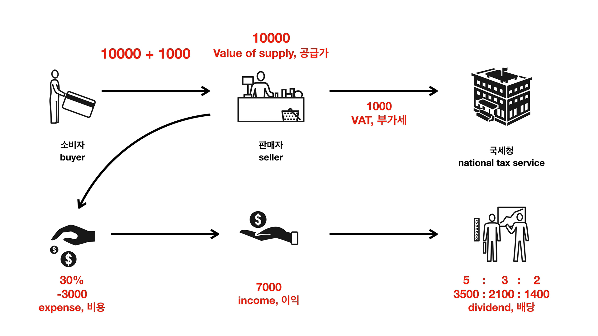

# OpenTutorial App

## 구상



판매자로서 무언가를 팔고 세금, 기타 비용등을 제하고 남은 이익을 동업자와 배분하는 상황 가정

## 프로그래밍

```java
public class AccountingApp
{

    public static void main(String[] args)
    {
        System.out.println("Value of supply : " + 10000.0);
        System.out.println("VAT : " + (10000.0 * 0.1));
        System.out.println("Total : " + (10000.0 + 10000.0 * 0.1));
        System.out.println("Expense : " + (10000.0 * 0.3));
        System.out.println("Income : " + (10000.0 - 10000.0 * 0.3));
        System.out.println("Devidend 1 : " + (10000.0 - 10000.0 * 0.3) * 0.5);
        System.out.println("Devidend 2 : " + (10000.0 - 10000.0 * 0.3) * 0.3);
        System.out.println("Devidend 3 : " + (10000.0 - 10000.0 * 0.3) * 0.2);
    }

}
```

- 어떠한 동작을 시간에 순서에 따라 실행되도록 작성

## 변수화

```java

public class AccountingApp
{

    public static void main(String[] args)
    {
        double valueOfSupply = Double.parseDouble(args[0]); // 물건의 가격을 인자로 받아오기
        double vatRate = 0.1;
        double expenseRate = 0.3;
        double vat = valueOfSupply * vatRate;
        double total = valueOfSupply + vat;
        double expense = valueOfSupply * expenseRate;
        double income = valueOfSupply - expense;
        double dividend1 = income * 0.5;
        double dividend2 = income * 0.3;
        double dividend3 = income * 0.2;
 
        System.out.println("Value of supply : " + valueOfSupply);
        System.out.println("VAT : " + vat);
        System.out.println("Total : " + total);
        System.out.println("Expense : " + expense);
        System.out.println("Income : " + income);
        System.out.println("Dividend 1 : " + dividend1);
        System.out.println("Dividend 2 : " + dividend2);
        System.out.println("Dividend 3 : " + dividend3);
    }

}
```

- 동일한 코드를 `변수`로 지정해 `데이터가 변할 때마다 새로 작성하는 수고`를 줄임
- 깔끔하고 간결한 코드는 덤

## 조건문

```java

public class AccountingIfApp
{

    public static void main(String[] args)
    {
        double valueOfSupply = Double.parseDouble(args[0]);
        double vatRate = 0.1;
        double expenseRate = 0.3;
        double vat = valueOfSupply * vatRate;
        double total = valueOfSupply + vat;
        double expense = valueOfSupply * expenseRate;
        double income = valueOfSupply - expense;

        double dividend1;
        double dividend2;
        double dividend3;

        // 조건문
        // 참이면 if문 다음의 코드 실행 / 거짓이면 else문 다음의 코드 실행
        if (income > 10000.0)
        {
            dividend1 = income * 0.5;
            dividend2 = income * 0.3;
            dividend3 = income * 0.2;
        } else
        {
            dividend1 = income * 1.0;
            dividend2 = income * 0;
            dividend3 = income * 0.2;
        }

        System.out.println("Value of supply : " + valueOfSupply);
        System.out.println("VAT : " + vat);
        System.out.println("Total : " + total);
        System.out.println("Expense : " + expense);
        System.out.println("Income : " + income);
        System.out.println("Dividend 1 : " + dividend1);
        System.out.println("Dividend 2 : " + dividend2);
        System.out.println("Dividend 3 : " + dividend3);
    }

}
```

## 배열

```java
public class AccountingArrayApp
{

    public static void main(String[] args)
    {
        double valueOfSupply = Double.parseDouble(args[0]);
        double vatRate = 0.1;
        double expenseRate = 0.3;
        double vat = valueOfSupply * vatRate;
        double total = valueOfSupply + vat;
        double expense = valueOfSupply * expenseRate;
        double income = valueOfSupply - expense;
        
        // double형 데이터만 들어가는 배열
        double[] dividendRates = new double[3];
        dividendRates[0] = 0.5;
        dividendRates[1] = 0.3;
        dividendRates[2] = 0.2;

        double dividend1 = income * dividendRates[0];
        double dividend2 = income * dividendRates[1];
        double dividend3 = income * dividendRates[2];

        System.out.println("Value of supply : " + valueOfSupply);
        System.out.println("VAT : " + vat);
        System.out.println("Total : " + total);
        System.out.println("Expense : " + expense);
        System.out.println("Income : " + income);
        System.out.println("Dividend 1 : " + dividend1);
        System.out.println("Dividend 2 : " + dividend2);
        System.out.println("Dividend 3 : " + dividend3);
    }

}
```

## 반복문

```java
public class AccountingArrayLoopApp
{

    public static void main(String[] args)
    {
        double valueOfSupply = Double.parseDouble(args[0]);
        double vatRate = 0.1;
        double expenseRate = 0.3;
        double vat = valueOfSupply * vatRate;
        double total = valueOfSupply + vat;
        double expense = valueOfSupply * expenseRate;
        double income = valueOfSupply - expense;

        System.out.println("Value of supply : " + valueOfSupply);
        System.out.println("VAT : " + vat);
        System.out.println("Total : " + total);
        System.out.println("Expense : " + expense);
        System.out.println("Income : " + income);

        // 반복문은 배열과 함께 쓰는 경우가 많음
        double[] dividendRates = new double[3];
        dividendRates[0] = 0.5;
        dividendRates[1] = 0.3;
        dividendRates[2] = 0.2;

        double dividend1 = income * dividendRates[0];
        double dividend2 = income * dividendRates[1];
        double dividend3 = income * dividendRates[2];

        // 배열의 길이만큼 반복
        int i = 0;
        while (i < dividendRates.length)
        {
            System.out.println("Dividend 1 : " + (income * dividendRates[i]));
            i = i + 1;
        }

    }

}
```