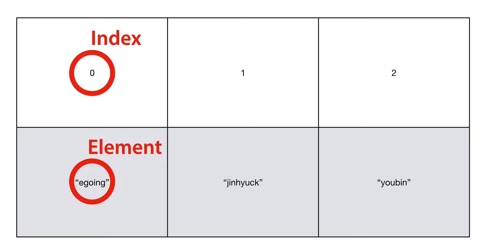

# 반복문과 배열

## 반복문

```java
public class LoopApp {
 
    public static void main(String[] args) {
         
        System.out.println(1);
        System.out.println("=== while ===");
        int i = 0;
        //..
        while(i < 3) {
            System.out.println(2);
            System.out.println(3);
//          i = i + 1;
            //..
            i++;
        }
        System.out.println("=== for ===");
        for(int j=0; j < 3; j++) {
            System.out.println(2);
            System.out.println(3);
        }
         
        System.out.println(4);
 
    }
 
}
```

#### 반복문 형태
 `while(조건문)`        
 `for(초기값; 조건문; 증가치;)`

- `while()` 문은 자유도가 높지만 특정 횟수만큼 반복하고 싶을 땐 `for()`문을 사용하는 것이 좋다

## 배열

```java
public class ArrayApp {

	public static void main(String[] args) {

//		String users = "gichul, sian, black";

		// 빈 배열에 데이터 추가
		String[] users = new String[3];

		users[0] = "gichul";
		users[1] = "sian";
		users[2] = "black";

		System.out.println(users[1]);
		System.out.println(users.length);

		// 데이터를 담은 배열 생성
		int[] scores = { 10, 27, 33 };

		System.out.println(scores[2]);
		System.out.println(scores.length);

	}

}
```
- `index`는 배열의 목차, `element`는 배열의 원소를 말한다


>출처 : 생활코딩(https://opentutorials.org/)
