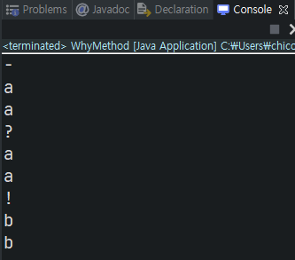

# 메서드의 기본 형식

```java
public class WhyMethod {

    public static void main(String[] args) {

        // 100000000 줄의 코드
        printTwoTimesA();
        // 100000000 줄의 코드
        printTwoTimesA();
        // 100000000 줄의 코드
        printTwoTimesA();

    }

    public static void printTwoTimesA() {
        System.out.println("-");
        System.out.println("a");
        System.out.println("a");
    }

}
```

메서드를 사용하지 않고 자바로 프로그래밍은 불가능한 일이다. 메서드를 사용하면

1. 반복되는 코드의 양을 줄일 수 있다
2. 코드의 의미를 파악하기 쉽다
3. 코드 수정이 효율적이다

## 메서드의 입력 값

```java
public class WhyMethod {

    public static void main(String[] args) {

        // 100000000 줄의 코드
        printTwoTimesA();
        // 100000000 줄의 코드
        printTwoTimesB("a");
        // 100000000 줄의 코드
        printTwoTimesC("b", "!"); // 인자, arguments

    }

    public static void printTwoTimesA() {
        System.out.println("-");
        System.out.println("a");
        System.out.println("a");
    }

    public static void printTwoTimesB(String text) {
        System.out.println("?");
        System.out.println(text);
        System.out.println(text);
    }

    public static void printTwoTimesC(String text, String delimiter) // 매개변수, parameter
    {
        System.out.println(delimiter);
        System.out.println(text);
        System.out.println(text);
    }

}
```

다른 값을 출력하기 위해 메서드를 복사하여 값만 바꾸는 것은 비효율적이다.            
입력 값을 받는다면 하나의 메서드로 다른 값을 얻을 수 있다.              
`printTwoTimesB(String text)`는 이전 메소드와는 다르게 `String`인 `"a" 인자`를 받아서 `text`라는 이름의 `매개변수`로 사용한다.          
`printTwoTimesB(String text, String delmiter)` 메서드는 두 개의 인자를 받아서 출력한다.



### 메서드의 출력

```java
public static String twoTimes(String text, String delimiter) {
        String out = "";
        out = out + delimiter + "\n";
        out = out + text + "\n";
        out = out + text + "\n";
        return out;
}

public static void main(String[] args) { 
    System.out.println(twoTimes("a", "+"));
}
```

메서드에서 `return`은 메서드의 실행 결과 값을 넘긴다. `return`은 메서드를 종료시키므로 뒤에 작성한 코드는 죽은 코드가 된다.         
자바에서 메서드는 리턴값의 자료형을 구분해야 한다. `void`는 아무것도 넘기지 않음을 말한다.          
또한 리턴값을 가진 메서드는 재사용성이 높아진다.

## 메서드의 활용

```java
public class AccountingApp {

    // 공급가액
    public static double valueOfSupply = 10000.0;

    // 부가가치세율
    public static double vatRate = 0.1;

    public static double getVAT() {
        return valueOfSupply * vatRate;
    }

    public static double getTotal() {
        return valueOfSupply + getVAT();
    }

    public static void main(String[] args) {

        // 부가세
        // double vat = valueOfSupply * vatRate;
        // double vat = getVAT();

        // 합계
        // double total = valueOfSupply + vat;
        // double total = getTotal();

        System.out.println("Value of supply : " + valueOfSupply);
        System.out.println("VAT : " + getVAT());
        System.out.println("Total : " + getTotal());

    }

}
```

`valueOfSupply`와 `vatRate`는 `전역변수`로써 class 내 어디서든 사용할 수 있게 해주었다.     

> 메서드를 통해 얻는 효과
1. 코드의 단순화
2. 네이밍을 통한 코드의 의미 파악
3. 코드의 재사용
