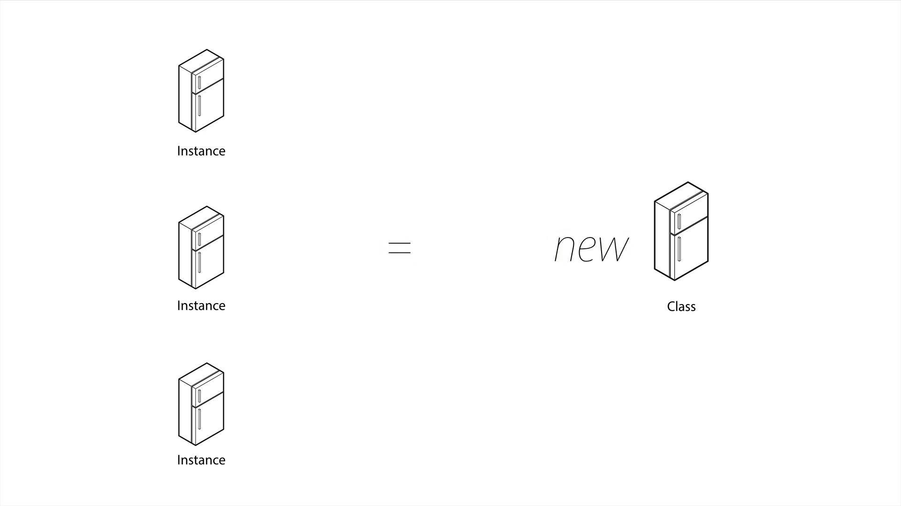
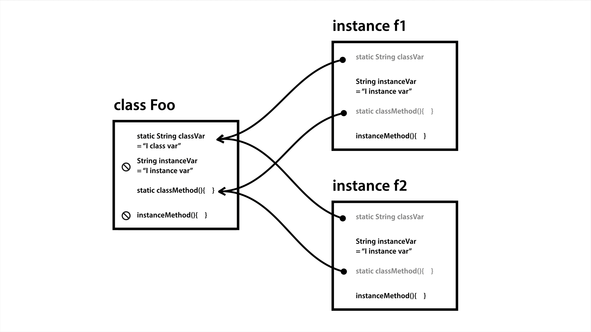

# 자바 객체 지향 프로그래밍

## 객체 지향과 절차 지향

먼저 **객체 지향 프로그래밍(OOP)** 과 **절차 지향 프로그래밍(PP)** 은 반대 개념이 아니다.     
PP는 **데이터를 중심으로 함수**를 만들어 사용하는 편이고, OOP는 **데이터와 기능(함수)를 묶어 하나의 객체**로 만들어 사용한다.       

Java에서 PP는 **메서드를 이용해** 작은 부품을 만들고 더 큰 프로그램을 만드는 것이다.          
반면 OOP는 서로 연관된 메서드와 변수들을 결합한 **클래스를 중심으로 프로그래밍하는 것**으로 볼 수 있다.


>출처 : 생활코딩(https://opentutorials.org/)

#### 절차 지향 프로그래밍의 특징        
    1. 객체나 클래스를 만들 필요 없이 프로그램을 코딩할 수 있다     
    2. 필요한 기능을 함수로 만들어 두기 때문에 같은 코드를 복사하지 않고 호출하여 사용할 수 있다        
    3. 프로그램의 흐름을 쉽게 추적할 수 있다        
    4. 각 코드가 유기성이 높기 때문에 수정하기가 힘들다     
    5. 코드를 재사용할 수 없어 개발 비용과 시간이 늘어날 수 있다        
    6. 디버그가 어렵다      

#### 객체 지향 프로그래밍의 특징        
    1. 모듈화, 캡슐화로 인해 유지보수에 용이하다        
    2. 객체 지향적이기 때문에 현실 세계와 유사성에 의해 코드를 이해하기 쉽게 만든다     
    3. 다른 프로그램에서 재사용이 가능하다      
    4. 속도가 상대적으로 느리고 많은 양의 메모리를 사용하는 경향이 있다     
    5. 설계 과정에 시간이 많이 투자된다     


## 클래스, 메서드와 변수

```java
// MyOOP.java
public class MyOOP {
    public static void main(String[] args) {
        Print.delimiter = "----";
        Print.A();        
        Print.B();

        Print.delimiter = "****";
        Print.A();
        Print.B();
    }
}

// Print.java
class Print { // 클래스
    public static String delimiter = ""; // 전역 변수

    public static void A() { // 메서드
        System.out.println(delimiter);
        System.out.println("A");
        System.out.println("A");
    }

    public static void B() {
        System.out.println(delimiter);
        System.out.println("B");
        System.out.println("B");
    }
}

```

연관성이 있는 반복되는 코드를 그룹핑하여 **메서드**로 만든다.    
반복되는 값은 **변수**로 설정하며 메서드 내부에서 정의된 변수는 메서드 밖에서 사용할 수 가 없다. 때문에 **전역 변수**로 선언하면 관리가 편하다.   
**클래스**는 이러한 메서드와 변수를 그룹핑한 것으로 훨씬 간결하고 좋은 코드를 짤 수 있게 된다. 또한 외부에서도 사용할 수 있어서 따로 만들어 호출하여 사용할 수 있다.

## 인스턴스


>출처 : 생활코딩(https://opentutorials.org/)

냉장고를 클래스라고 생각해보자. 똑같은 냉장고를 여러 개를 만들어 안에 다양한 재료로 채울 수 있다. **인스턴스**가 바로 복제된 냉장고다.      
똑같은 냉장고를 만들 땐 `new`를 붙여준다.

```java
// MyOOP.java
public class MyOOP {
    public static void main(String[] args) {
        Print p1 = new Print();
        p1.delimiter = "----";
        p1.A();        
        p1.B();

        Print p2 = new Print();
        p2.delimiter = "****";
        p2.A();
        p2.B();

        // Print.delimiter = "----";
        p1.A();
        // Print.delimiter = "****";
        p2.A();
        p1.B();
        p2.B();
    }
}

// Print.java
class Print { // 클래스
    public static String delimiter = ""; // 전역 변수

    public void A() { // 메서드
        System.out.println(delimiter);
        System.out.println("A");
        System.out.println("A");
    }

    public void B() {
        System.out.println(delimiter);
        System.out.println("B");
        System.out.println("B");
    }
}

```

`delimiter`를 매번 바꾸는 것은 번거로운 일이며 효율적이지 않다. 인스턴스를 사용하면 더 쉽게 작업이 가능해진다.      
인스턴스를 사용하기 전에 `static`은 항상 값이 변하지 않는 경우에 사용하는 데 지금은 `delimeter` 변수의 값을 변경할테니 지워준다.     
`Print p1 = new Print();`는 Print 데이터 타입의 Print 클래스를 p1 객체에 담는다라고 할 수 있다.         
p1과 p2의 delimeter 변수값을 설정함으로써 같은 클래스를 돌려막지 않아도 된다.

## static

```java
class Foo {
    public static String classVar = "I class var"; // static 변수 (클래스 필드)
    public String instanceVar = "I instance var"; // non-static 변수 (인스턴스 필드)

    public static void classMethod() { // 클래스의 static 메서드가 클래스의 변수에 접근이 가능할까?
        System.out.println(classVar); // static 메서드는 static 변수에 접근 가능
//      System.out.println(instanceVar); // 인스턴스 변수에는 접근 불가능
    }

    public void instanceMethod() { // 인스턴스 메서드는 클래스의 변수에 접근이 가능할까?
        System.out.println(classVar); // 인스턴스 메서드는 static 변수에 접근 가능
        System.out.println(instanceVar); // 인스턴스 변수에도 접근 가능
    }
}

public class StaticApp {

    public static void main(String[] args) {
        System.out.println(Foo.classVar); // Foo 클래스의 static 변수에 접근 가능
//      System.out.println(Foo.instanceVar); // 인스턴스 변수에 접근 불가능
        Foo.classMethod(); // static 메서드에 접근 가능
//      Foo.instanceMethod(); // 인스턴스 메서드에 접근 불가능

        // Foo f1, f2 인스턴스 생성
        Foo f1 = new Foo(); 
        Foo f2 = new Foo();
      
        System.out.println(f1.classVar); // I class var
        System.out.println(f1.instanceVar); // I instance var
      
        f1.classVar = "changed by f1";
        System.out.println(Foo.classVar); // changed by f1
        System.out.println(f2.classVar); // changed by f1
      
        f1.instanceVar = "changed by f1";
        System.out.println(f1.instanceVar); // changed by f1
        System.out.println(f2.instanceVar); // I instance var
    }

}
```



**static** 키워드로 변수나 메서드 앞에 붙여 static 변수와 메서드를 만들 수 있다. 클래스 멤버라고도 하는 데, 모든 객체가 메모리를 공유하는 특징이 있다.     

```java
static int num = 0; // static 변수 선언
public static void static_method(){} // static 리턴 타입 메소드 {}
```

static으로 선언된 변수와 메서드는 같은 메모리를 가리키므로 `Foo.classVar`와 인스턴스 `f1.classVar`, `f2.classVar`는 같은 메모리를 사용한다.    
`f1.classVar = "changed by f1";` 로 static 변수값을 변경하면 Foo와 f1, f2의 classVar가 다 똑같은 변수값을 가리키게 된다.        
하지만 인스턴스는 각 다른 객체이므로 `f1.instanceVar = "changed by f1";` 를 작성하면 f1의 instanceVar 값만 바뀌게 된다.

## 생성자와 this

```java
// MyOOP.java
public class MyOOP {
    public static void main(String[] args) {
        Print p1 = new Print("----"); // 인자
        p1.A();        
        p1.B();

        Print p2 = new Print("****");
        p2.A();
        p2.B();
    }
}

// Print.java
class Print { // 클래스
    public String delimiter = ""; // 인스턴스 변수
    public Print(String delimiter){
        this.delimiter = delimiter; // this.delimiter = 인자 delimiter
    }
    public void A() { // 메서드
        System.out.println(this.delimiter);
        System.out.println("A");
        System.out.println("A");
    }

    public void B() {
        System.out.println(this.delimiter);
        System.out.println("B");
        System.out.println("B");
    }
}
```

> 생성자(Consutructor) 규칙
>> 1. 클래스명과 메서드명이 동일하다
>> 2. 리턴타입을 정의하지 않는다

생성자는 new 키워드가 사용될 때 호출된다. 생성자를 사용할 때 얻는 이득은 객체 생성 시에 필수적인 행동을 제어할 수 있다는 것이다.        
`this` 키워드는 인스턴스의 변수명을 가리키는데 `this`를 사용하지 않는다면 인자로 들어온 `delimiter`를 가리키게 된다.

생성자의 입력 항목이 없고 생성자 내부에 아무 내용이 없으면 **default 생성자**라고 부른다. 만약 클래스에 생성자가 하나도 없다면 자동으로 default 생성자가 추가되지만, 사용자가 작성한 생성자가 하나라도 구현되어 있다면 컴파일러는 default 생성자를 추가하지 않는다.

## 클래스와 인스턴스 활용

```java
// 기존 코드
public class AccountingApp {
    public static double valueOfSupply = 10000.0;
    public static double vatRate = 0.1;
    public static double getVAT() {
        return valueOfSupply * vatRate;
    }  
    public static double getTotal() {
        return valueOfSupply + getVAT();
    }
    public static void main(String[] args) {
 
        System.out.println("Value of supply : " + valueOfSupply);
        System.out.println("VAT : " + getVAT());
        System.out.println("Total : " + getTotal());
    }
}
// 클래스 활용
class Accounting {
    public static double valueOfSupply;
    public static double vatRate = 0.1;
    public static double getVAT() {
        return valueOfSupply * vatRate;
    }
    public static double getTotal() {
        return valueOfSupply + getVAT();
    }
}

public class AccountingApp {
    public static void main(String[] args) {
        Accounting.valueOfSupply = 10000.0;
        System.out.println("Value of supply : " + Accounting.valueOfSupply);
        System.out.println("VAT : " + Accounting.getVAT());
        System.out.println("Total : " + Accounting.getTotal());
    }
}

// 인스턴스 활용
class Accounting {
    public double valueOfSupply;
    public static double vatRate = 0.1;

    public Accounting(double valueOfSupply) {
        this.valueOfSupply = valueOfSupply;
    }

    public double getVAT() {
        return valueOfSupply * vatRate;
    }

    public double getTotal() {
        return valueOfSupply + getVAT();
    }
}

public class AccountingApp {
    public static void main(String[] args) {
        Accounting a1 = new Accounting(10000.0);

        Accounting a2 = new Accounting(20000.0);

        System.out.println("Value of supply : " + a1.valueOfSupply);
        System.out.println("Value of supply : " + a2.valueOfSupply);

        System.out.println("VAT : " + a1.getVAT());
        System.out.println("VAT : " + a2.getVAT());

        System.out.println("Total : " + a1.getTotal());
        System.out.println("Total : " + a2.getTotal());

    }
}
```
#### 1. 클래스 활용
---
기존에 메서드만 이용한 코드보다 클래스를 활용하여 더 정리정돈된 코드를 작성할 수 있다. 예제와 달리 코드가 훨씬 많을 때 `Accounting`처럼 서로 연관된 코드들을 클래스로 그룹화하면 `Accounting.foo` 등으로 보기 쉽게 구분하여 작업할 수 있게 된다.

#### 2. 인스턴스 활용
---
만약 `valueOfSupply`의 값이 다르고 계산의 순서가 달라지면 클래스만 써서는 코드를 정리할 수 없다. 같은 작업이지만 다른 값을 사용해야할 때 인스턴스를 활용하면 쉽게 정리할 수 있다. `Accounting` 클래스를 각 `a1`, `a2`로 인스턴스를 만들고 인자로 `valueOfSupply` 값을 받아오게 설정하여 정리된 모습이다.