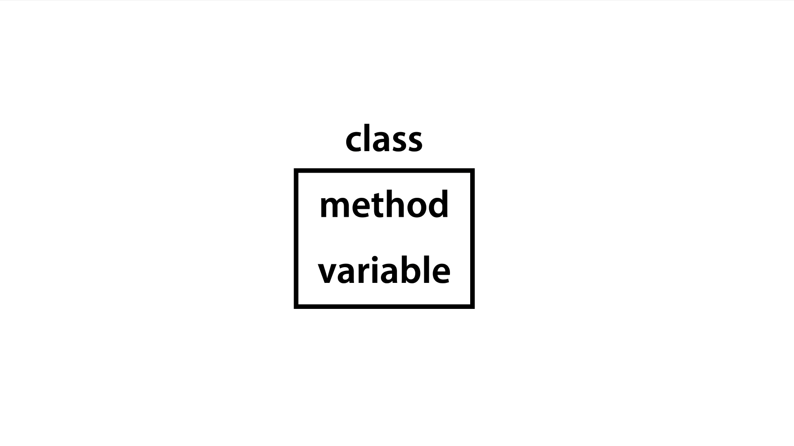

# 자바 객체 지향 프로그래밍

## 객체 지향과 절차 지향

먼저 **객체 지향 프로그래밍(OOP)** 과 **절차 지향 프로그래밍(PP)** 은 반대 개념이 아니다.     
PP는 `데이터를 중심으로 함수`를 만들어 사용하는 편이고, OOP는 `데이터와 기능(함수)를 묶어 하나의 객체`로 만들어 사용한다.       

Java에서 PP는 `메서드를 이용해` 작은 부품을 만들고 더 큰 프로그램을 만드는 것이다.          
반면 OOP는 서로 연관된 메서드와 변수들을 결합한 `클래스를 중심으로 프로그래밍하는 것`으로 볼 수 있다.



#### 절차 지향 프로그래밍의 특징       
    1. 객체나 클래스를 만들 필요 없이 프로그램을 코딩할 수 있다     
    2. 필요한 기능을 함수로 만들어 두기 때문에 같은 코드를 복사하지 않고 호출하여 사용할 수 있다        
    3. 프로그램의 흐름을 쉽게 추적할 수 있다        
    4. 각 코드가 유기성이 높기 때문에 수정하기가 힘들다     
    5. 코드를 재사용할 수 없어 개발 비용과 시간이 늘어날 수 있다        
    6. 디버그가 어렵다      

#### 객체 지향 프로그래밍의 특징       
    1. 모듈화, 캡슐화로 인해 유지보수에 용이하다        
    2. 객체 지향적이기 때문에 현실 세계와 유사성에 의해 코드를 이해하기 쉽게 만든다     
    3. 다른 프로그램에서 재사용이 가능하다      
    4. 속도가 상대적으로 느리고 많은 양의 메모리를 사용하는 경향이 있다     
    5. 설계 과정에 시간이 많이 투자된다     


## 클래스, 메서드와 변수

```java
class Print { // 클래스
    public static String delimiter = ""; // 전역 변수

    public static void A() { // 메서드
        System.out.println(delimiter);
        System.out.println("A");
        System.out.println("A");
    }

    public static void B() {
        System.out.println(delimiter);
        System.out.println("B");
        System.out.println("B");
    }
}

public class MyOOP {
    public static void main(String[] args) {
        Print.delimiter = "----";
        Print.A();        
        Print.B();

        Print.delimiter = "****";
        Print.A();
        Print.B();
    }
}
```

연관성이 있는 반복되는 코드를 그룹핑하여 `메서드`로 만든다.    
반복되는 값은 `변수`로 설정하며 `메서드` 내부에서 정의된 변수는 메서드 밖에서 사용할 수 가 없다. 때문에 `전역 변수`로 선언하면 관리가 편하다.   
`클래스`는 이러한 메서드와 변수를 그룹핑한 것으로 훨씬 간결하고 좋은 코드를 짤 수 있게 된다.