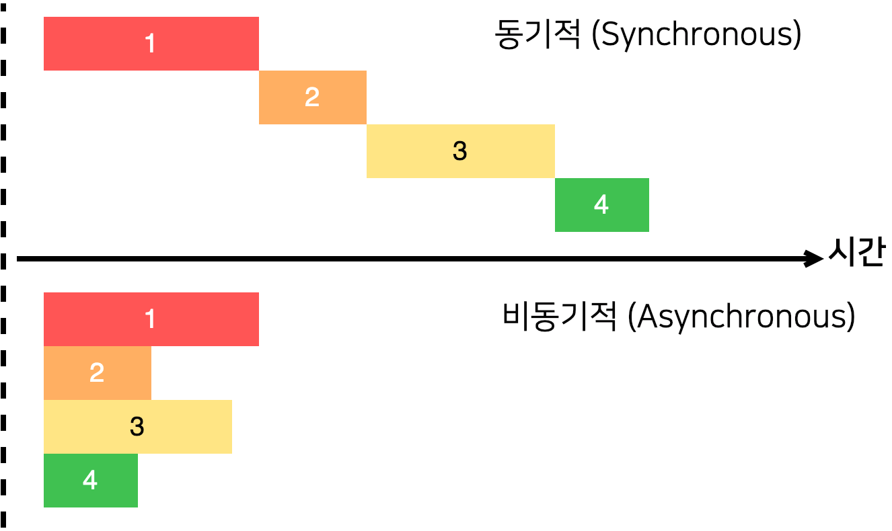

# 동기와 비동기

## 동기와 비동기

`동기`는 작업을 순서대로 진행하는 것이고 `비동기`는 순서 상관없이 바로 실행되는 방식이다.

 
> https://learnjs.vlpt.us/

```js
// Sync example
console.log('1');
console.log('2');
console.log('3');

// result
1
2
3

// Async example
function foo() {
  console.log('1');
}
 
setTimeout(foo, 2000);
console.log('2');
console.log('3');

// result
2
3
1
```

## 비동기적 처리를 위한 방식들

### Callback 함수

Callback 함수는 어떤 이벤트가 발생했거나 특정 시점에 도달했을 때 시스템에서 호출하는 함수를 말한다.        
하지만 가독성이 떨어지며 각각 에러 처리를 해주어야만 한다.

```js
// example
function greeting(name) {
  alert('Hello ' + name);
}

function processUserInput(callback) {
  var name = prompt('Please enter your name.');
  callback(name);
}

processUserInput(greeting);
```

### [Promise 객체](https://developer.mozilla.org/ko/docs/Web/JavaScript/Reference/Global_Objects/Promise)

Promise 객체는 비동기 작업이 맞이할 미래의 완료 또는 실패와 그 결과 값을 나타낸다.      
비동기 메서드에서 마치 동기 메서드처럼 값을 반환할 수 있다.

> 대기(pending): 이행하거나 거부되지 않은 초기 상태.    
> 이행(fulfilled): 연산이 성공적으로 완료됨.    
> 거부(rejected): 연산이 실패함.


### [async & await](https://developer.mozilla.org/ko/docs/Web/JavaScript/Reference/Statements/async_function)

- `async`는 `Promise`를 리턴한다.
- `await`는 `async` 내부에서만 사용이 가능하다.
- `try/catch`로 에러를 잡을 수 있다.

```js
// example
function resolveAfter2Seconds() {
  return new Promise(resolve => {
    setTimeout(() => {
      resolve('resolved');
    }, 2000);
  });
}

async function asyncCall() {
  console.log('calling');
  const result = await resolveAfter2Seconds();
  console.log(result);
  // expected output: "resolved"
}

asyncCall();
```

## [블로킹과 논블로킹](https://nodejs.org/ko/docs/guides/blocking-vs-non-blocking/)

- `블로킹`은 NodeJS 프로세스에서 추가적인 JS의 실행을 위해 기다려야 하는 상황.
- 이벤트 루프가 `블로킹` 작업을 하는 동안 JS 실행을 계속할 수 없다.
- 호출되는 함수가 바로 리턴하느냐 마느냐의 차이.
- NodeJS에서는 

```js
// Sync example
const fs = require('fs');
const data = fs.readFileSync('/file.md'); // 파일을 읽을 때까지 여기서 블로킹됩니다.
console.log(data);
// moreWork();는 console.log 이후 실행될 것입니다.

// Async example
const fs = require('fs');
fs.readFile('/file.md', (err, data) => {
  if (err) throw err;
  console.log(data);
});
// moreWork();는 console.log 이전에 실행될 것입니다.
```

첫 예제에서는 `console.log()`가 실행된 후에 다음 작업이 실행될 것이고, 두 번째 예제에서는 `fs.readFile()`가 `논블로킹`이므로 다음 작업이 있다면 바로 실행될 것이다.