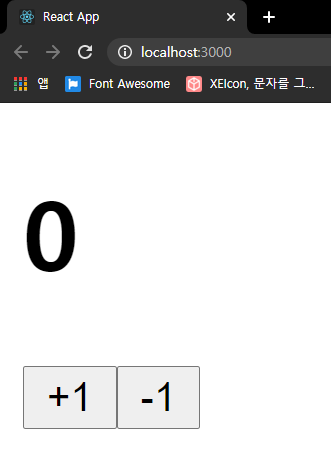
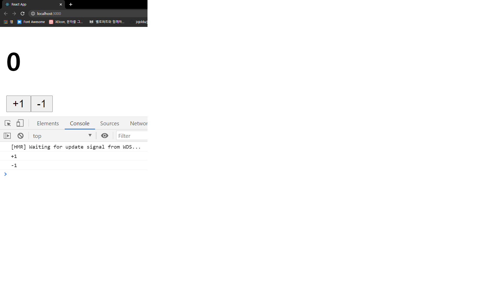
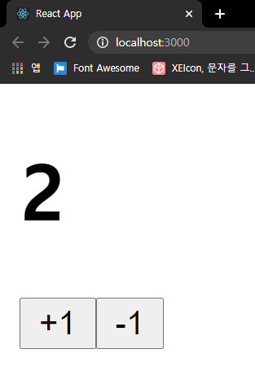

# useState

함수형 컴포넌트에서 상태를 관리할 수 있게 Hooks가 생겼다.
useState는 React Hooks 중 하나이다.

## 컴포넌트 생성

```js
// Counter.js
function Counter() {
  return (
    <div>
      <h1>0</h1>
      <button>+1</button>
      <button>-1</button>
    </div>
  );
}

// App.js
function App() {
  return <Counter />;
}
```



## 이벤트 설정

```js
// Counter.js
function Counter() {
  const onIncrease = () => {
    console.log("+1");
  };
  const onDecrease = () => {
    console.log("-1");
  };
  return (
    <div>
      <h1>0</h1>
      <button onClick={onIncrease}>+1</button>
      <button onClick={onDecrease}>-1</button>
    </div>
  );
}
```

- 함수를 만들고 `onClick`으로 연결해주었다.
- React에서 엘리먼트에 이벤트를 설정할 때는 `on이벤트명={실행함수}` 형태로 설정해야 한다.
- `onClick={onIncrease()}` 식으로 작성하면 렌더링되는 시점에서 함수가 호출되므로 주의해야 한다.



## useState

컴포넌트에서 동적인 값을 상태`state`라고 한다.  
React의 `useState`라는 함수를 사용하면 컴포넌트에서 상태를 관리할 수 있다.

```js
// Counter.js
import React, { useState } from "react";

function Counter() {
  const [number, setNumber] = useState(0);

  const onIncrease = () => {
    setNumber(number + 1);
  };

  const onDecrease = () => {
    setNumber(number - 1);
  };

  return (
    <div>
      <h1>{number}</h1>
      <button onClick={onIncrease}>+1</button>
      <button onClick={onDecrease}>-1</button>
    </div>
  );
}
```

```js
import React, { useState } from "react";
```

React에서 useState 함수를 불러오는 코드다.

```js
const [number, setNumber] = useState(0);
```

`useState`를 사용할 때는 상태의 기본값을 파라미터로 넣어서 호출한다.  
함수를 호출하면 배열이 반환되는 데, 첫번째 원소는 현재 상태, 두번째 원소는 Setter 함수이다.  
Setter 함수는 파라미터로 전달 받은 값을 최신 상태로 설정해준다.

```html
<h1>{number}</h1>
```

h1 태그는 이제 `{number}` 값을 보여주어야 한다.



## 함수형 업데이트

업데이트하고 싶은 새로운 값을 파라미터에 넣는 대신,  
어떻게 업데이트를 할 지에 대한 함수를 등록하는 방식을 사용할 수도 있다.

```js
// Counter.js
function Counter() {
  const [number, setNumber] = useState(0);

  const onIncrease = () => {
    setNumber((prevNumber) => prevNumber + 1);
  };

  const onDecrease = () => {
    setNumber((prevNumber) => prevNumber - 1);
  };

  return (
    <div>
      <h1>{number}</h1>
      <button onClick={onIncrease}>+1</button>
      <button onClick={onDecrease}>-1</button>
    </div>
  );
}
```

`onIncrease`와 `onDecrease`에서 `setNumber`를 사용할 때 그 다음 상태를 파라미터로 넣어준 게 아니라,  
값을 업데이트하는 함수를 파라미터로 넣었다.

함수형 업데이트는 주로 나중에 컴포넌트를 최적화할 때 사용된다.
