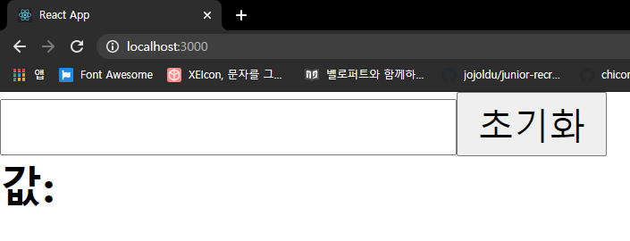
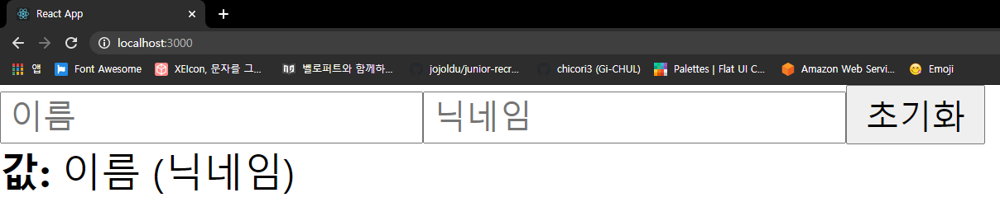

# input

## input 상태 관리하기

```js
// Input.js
function Input() {
  return (
    <div>
      <input />
      <button>초기화</button>
      <div>
        <b>값: </b>
      </div>
    </div>
  );
}

export default Input;

// App.js
function App() {
  return <Input />;
}
```



- input에 입력한 값이 하단에 나타나고, 초기화를 누르면 input 값이 비워지도록 구현한다.
- input의 `onChange` 이벤트와 `useState`를 사용한다.
- 이벤트에 등록하는 함수에서 이벤트 객체 `e`를 파라미터로 받을 수 있는데 이 객체의 `e.target`은 이벤트가 발생한 DOM인 input DOM을 가리키게 된다. DOM의 `e.target.value`를 조회하면 input에 입력된 값을 알 수 있다.

```js
// Input.js
function Input() {
  const [text, setText] = useState("");

  const onChange = (e) => {
    setText(e.target.value);
  };

  const onReset = () => {
    setText("");
  };

  return (
    <div>
      <input onChange={onChange} value={text} />
      <button onClick={onReset}>초기화</button>
      <div>
        <b>값: {text}</b>
      </div>
    </div>
  );
}
```

- input의 상태를 관리할 때 input 태그의 `value` 값도 설정해주는 것이 중요하다.
- 상태가 바뀌었을 때 input의 내용도 업데이트 된다.

## 여러개의 input 상태 관리하기

```js
function Input() {
  const onChange = (e) => {};

  const onReset = () => {};

  return (
    <div>
      <input placeholder="이름" />
      <input placeholder="닉네임" />
      <button onClick={onReset}>초기화</button>
      <div>
        <b>값: </b>
        이름 (닉네임)
      </div>
    </div>
  );
}
```



- `useState`와 `onChange`를 여러번 사용할 수도 있지만 좋은 방법은 아니다.
- input에 `name`을 설정하고 이벤트가 발생했을 때 값을 참조하는 방법이 있다.
- `useState`에서는 문자열이 아닌 객체 형태의 상태를 관리해야 한다.

```js
function Input() {
  const [inputs, setInputs] = useState({
    name: "",
    nickname: "",
  });

  const { name, nickname } = inputs; // 비구조화 할당을 통해 값 추출

  const onChange = (e) => {
    const { value, name } = e.target; // 우선 e.target 에서 name 과 value 를 추출
    setInputs({
      ...inputs, // 기존의 input 객체를 복사한 뒤
      [name]: value, // name 키를 가진 값을 value 로 설정
    });
  };

  const onReset = () => {
    setInputs({
      name: "",
      nickname: "",
    });
  };

  return (
    <div>
      <input name="name" placeholder="이름" onChange={onChange} value={name} />
      <input
        name="nickname"
        placeholder="닉네임"
        onChange={onChange}
        value={nickname}
      />
      <button onClick={onReset}>초기화</button>
      <div>
        <b>값: </b>
        {name} ({nickname})
      </div>
    </div>
  );
}
```

React 상태에서 객체를 수정해야 할 때는 새로운 객체를 만들어서 사용해야 한다.

```js
// Do NOT
inputs[name] = value;

// Do
setInputs({
  ...inputs,
  [name]: value,
});
```

...문법은 `spread` 문법으로 객체의 내용을 펼쳐서 기존 객체를 복사하는 기능을 한다.  
이러한 작업을 '불변성을 지킨다'라고 하고 컴포넌트가 상태를 감지하여 리렌더링이 진행될 수 있다.
