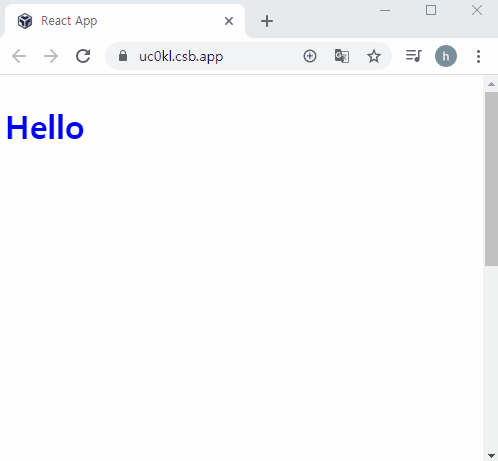

# useScroll

```js
const useScroll = () => {
  const [state, setState] = useState({
    // x, y의 초기값
    x: 0,
    y: 0,
  });
  const onScroll = () => {
    setState({ y: window.scrollY, x: window.scrollX });
  };
  useEffect(() => {
    window.addEventListener("scroll", onScroll);
    return () => window.removeEventListener("scroll", onScroll);
  }, []);
  return state;
};

const App = () => {
  const { y } = useScroll();
  return (
    <div class="App" style={{ height: "1000vh" }}>
      <h1 style={{ position: "fixed", color: y > 100 ? "red" : "blue" }}>Hi</h1>
    </div>
  );
};
```

- 화면을 스크롤했을 때 변화를 주고 싶다면 사용할 수 있는 `useScroll`

#### 코드실행결과

</img>
