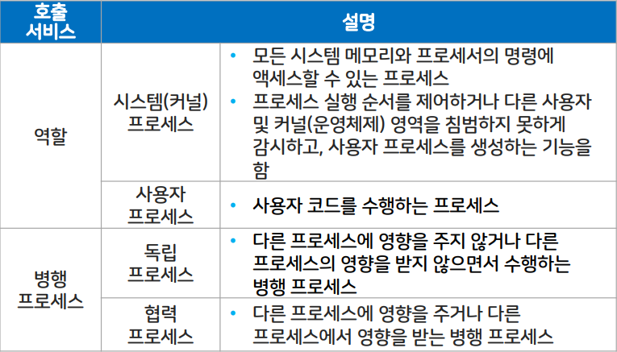

# 프로세스와 스레드

## 프로세스 개요와 상태 변화

### 프로세스 개요

#### 프로세스 정의

- 실행 중인 프로그램
- 비동기적 행위
- 실행 중인 프로시저
- 운영체제에 들어있는 프로세스 제어 블록
- 개체 디스패치가 가능한 대상
> 프로그램과 프로세스 : 프로그램이 메모리로 적재되어 운영체제의 제어를 받으면 프로세스가 됨

#### 시스템 관점

#### 프로세스 종류

### 프로세스 상태 변화와 상태 정보

#### 프로세스 상태 변화

- 운영체제가 프로세서 스케줄러
- 작업 스케줄러 : 실행할 작업 선정하고 준비 리스트에 삽입
- 프로세스 스케줄러 : 작업의 상태를 변화시키며 프로세스 생성에서 종료까지 과정 수행

- 프로세스 제어 블록
    - 운영체제가 프로세스 제어 시 필요한 프로세스 상태 정보 저장
    - 프로세스가 생성되면 메모리에 프로세스 제어 블록 생성
    - 프로세스가 종료되면 프로세스 제어 블록도 삭제

#### 프로세스 교환

- 실행 중인 프로세스의 제어를 다른 프로세스에 넘겨 해당 프로세스가 실행 상태가 되도록 하는 것
- 프로세스 문맥 교환이 일어나면 제어권을 넘기는 프로세서의 레지스터 내용을 PCB에 저장하게 됨

#### 프로세스 생성 구조

- 프로세스는 실행 중에 프로세스 생성 시스템을 호출, 새로운 프로세스 생성 가능
- 부모-자식 관계가 유지되며 계층적으로 생성됨

### 프로세스 생성, 종료와 제거

#### 프로세스 생성 시기

- 일괄처리 환경 : 작업이 준비 큐에 도착할 때 프로세스 생성
- 대화형 환경 : 새로운 사용자가 로그온할 때 프로세스 생성

#### 프로세스 생성 시 필요한 세부 작업 순서

1. 새로운 프로세스에 프로세스 식별자 할당
2. 주소 공간과 프로세스 제어 블록 공간 할당
3. 프로세스 제어 블록 초기화
4. 링크(해당 큐에 삽입)

#### 프로세스 종료

- 프로세스가 마지막 명령의 실행을 마치면 종료되고 운영체제에 삭제를 요청함
- 일괄처리 환경 : 작업 종료 신호로 인터럽트 발생 또는 시스템 호출
- 대화형 환경 : 사용자가 로그오프하거나 터미널을 닫음
- 부모 프로세스의 자식 프로세스 종료
> 프로세스 종료 이유 : 정상 종료, 시간 초과, 실패, 오류, 메모리 부족 등

#### 프로세스 제거

- 프로세스를 파괴하는 것
- 사용하던 자원을 시스템에 돌려주고 프로세스 제어 블록이 회수됨
- 프로그램은 여전히 디스크에 저장되어 있음

### 프로세스 중단과 재시작

#### 프로세스의 중단

- 시스템 유휴시간 문제를 프로세스 중단 상태를 이용해 해결 가능
- 운영체제는 새로운 프로세스를 생성하여 실행하거나 실행 중인 프로세스를 중단했다가 다시 실행 가능
- 단일 처리 시스템은 스스로 중단하고 다중 처리 시스템은 다른 프로세스가 중단함
- 중단된 프로세스는 중단된 지점부터 다시 시작함

### 프로세스 우선순위

#### 프로세스 스케줄러

- 프로세스 제어 블록의 우선순위 값을 변경 가능
- 우선순위를 이용하여 준비 리스트의 프로세스를 처리
- 프로세서 중심 프로세스(낮은 우선순위)와 입출력 중심 프로세스(높은 우선순위)로 구분

### 프로세스 문맥 교환

#### 프로세스 문맥 교환 발생

- 오버헤드 발생
    > 오버헤드는 운영체제 설계 시 불필요한 문맥 교환 감소가 목표
- 프로세스가 준비, 실행, 대기 중 각 상태로 서로 바뀔 때 발생
- 레지스터, 작업, 스레드, 프로세스 문맥 교환 등이 가능

---

## 스레드 개념과 상태 변화

### 스레드 개념

프로세스의 특성인 자원과 제어에서 제어만 분리한 실행 단위   
같은 프로세스의 스레드들은 동일한 주소 공간 보유

#### 스레드의 구조

#### 스레드의 병렬 수행

- 프로세스에 포함된 스레드들은 공동의 목적 달성을 위해 병렬 수행함
- 프로세스가 하나인 다른 프로세서에서 프로그램의 다른 부분을 동시 실행함

#### 병렬 수행의 이점

- 사용자 응답성 증가
- 자원과 메모리 공유 가능
- 경제성 좋음
- 다중 처리로 성능과 효율 향상

### 단일 스레드와 멀티 스레드

단일 스레드 : 개념 불확실
멀티 스레드 : 프로그램을 여러 실행 단위로 쪼개어 실행함

#### 스레드를 이용한 비동기적 요소 구현

### 스레드의 상태 변화와 제어 블록

#### 스레드의 상태 변화

- 프로세서를 함께 사용, 항상 스레드 하나만 실행됨
- 한 프로세스의 스레드는 순차적으로 실행됨
- 프로세스를 생성하면 스레드도 함께 생성됨

#### 스레드의 제어 블록

- 정보 저장
- 프로세스 제어 블록은 스레드 제어 블록의 리스트
- 스레드 간에 보호하지 않음

---

## 스레드의 구현

### 사용자 수준 스레드

#### 사용자 수준 스레드 : 다대일 매핑

- 이식성 높음
- 오버헤드 적음
- 유연한 스케줄링 기능
- 시스템의 동시성을 지원하지 않음
- 확장 제약이 따름
- 스레드 간 보호 불가

#### 커널 수준 스레드 : 일대일 매핑

커널이 스레드와 관련된 모든 작업을 관리함

- 다수의 스레드가 프로세서를 할당받아 병행 수행
- 스레드가 대기 상태가 되면 동일한 프로세스의 다른 스레드로 교환 가능
- 커널 지원 부족 문제를 해결 가능

#### 혼합형 스레드 : 다대다 매핑

사용자 수준 스레드와 커널 수준 스레드를 혼합한 구조

- 스레드 라이브러리가 최적의 성능 지원
- 응용 프로그램이 커널 영역에서의 병렬 처리 정도를 결정 가능
- 스레드 풀링 이용 일대일 매핑으로 오버헤드 감소 가능