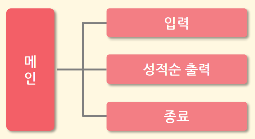

# 애플리케이션 구현

## 프로그램 설계

### 1. 프로그램 기능 정의

프로그램명 : 성적 처리 프로그램
주요 기능 : 학생들의 성적의 평균을 구하여 성적순으로 출력
자료구조 : 이름, 국어, 영어, 수학, 평균
요구사항 : 학생 이름은 10글자 이내, 최대 20명, 평균값 자동계산, 메뉴 방식 UI

### 2. 자료 구조 정의

```c++
struct sungjuk {
    char name[10];      // 이름 : 문자
    int kor, eng, mat;  // 성적 : 정수
    double avg;         // 평균 : 실수
}
```

### 3. 메뉴 구조



## 코드 분석

### 1. 헤더 파일

```c++
#include <stdio.h>

#define ST_NUM 20

#define NAME_LENGTH 10

typedef struct sungjuk{
    char name[NAME_LENGTH];
    int kor, eng, mat;
    double avg;
}SUNGJUK;

int inScore(SUNGJUK* , int);
void outScore(SUNGJUK* , int);
void sortScore(SUNGJUK* , int);
```

### 2. main 함수

```c++
int main()
{
    int sel, totalSCnt=0;
    SUNGJUK student[ST_NUM];
    while(1) {
        puts("\n원하는 메뉴를 선택하세요");
        puts("1. 성적입력");
        puts("2. 성적순출력");
        puts("0. 종료 ");
        scanf("%d", &sel);
        fflush(stdin);

        switch(sel){
    
            case 1 : totalSCnt= inScore(student, totalSCnt); break;
            case 2 : outScore(student, totalSCnt); break;
            case 0 : return 0;
            default : puts(“0~3 사이의메뉴번호를선택하세요”);
        }
    }
}
```

### 3. 입출력 함수

```c++
#include "scoreHeader.h"

int inScore(SUNGJUK* st, int cnt)
{
    char op;
    do {
        fflush(stdin);
        printf("\n이름 : ");
        gets(st[cnt].name);
        printf("국어 : ");
        scanf("%d",&st[cnt].kor);
        printf("영어 : ");
        scanf("%d",&st[cnt].eng);
        printf("수학 : ");
        scanf("%d",&st[cnt].mat);
        puts("계속 입력하시겠습니까?(y/n)");
        fflush(stdin);
        op = getc(stdin);
        st[cnt].avg = (double)(st[cnt].kor+st[cnt].eng+st[cnt].mat)/3.0;
    cnt++;
    } while(op!='n');
    return cnt;
}
```

```c++
void outScore(SUNGJUK* st, int cnt) {
    int i;
    sortScore(st,cnt);
    printf("\n----------------------------------------------------");
    printf("\n 순위 이름 국어 영어 수학 평균 ");
    printf("\n----------------------------------------------------\n");
    for(i=0;i<cnt;i++) {
        printf("% 2d %10s %5d %5d %5d %3.1f\n",
        i+1, st[i].name, st[i].kor, st[i].eng, st[i].mat, st[i].avg);
    }
}
```

```c++
void sortScore(SUNGJUK* st, int cnt) {
    SUNGJUK temp;
    int i,j;
    for(i=0; i<cnt-1 ;i++) {
        for(j=0; j<(cnt-i)-1; j++) {
            if(st[j].avg<st[j+1].avg) {
                temp=st[j];
                st[j]=st[j+1];
                st[j+1]=temp;
            }
        }
    }
}
```