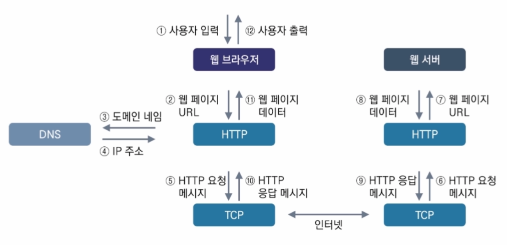

# 웹과 HTML5

## 웹이란

### 웹의 개념과 특징

1. 개념

- World Wide Web

- 인터넷에 연결된 컴퓨터를 통해 정보를 공유할 수 있는 정보 공간

2. 특징

- 멀티미디어 정보를 **하이퍼텍스트** 방식으로 연결
    > 웹 상의 문서끼리 서로 참조하는 기술

- HTML 언어 사용
- HTTP, HTTPS 프로토콜 사용

### 웹의 구성요소와 동작

1. 구성요소

웹 클라이언트
- 필요한 데이터를 웹 서버에 요청하는 주체

웹 브라우저
- Request Message를 작성하여 웹 서버에 전달

- 웹 서버로부터 전달받은 Response Message를 해석
    > 사용자에게 보여주는 SW

HTTP
- 정보를 주고 받을 수 있는 프로토콜

- Hyper Text를 전달하기 위해 만들어짐
- TCP 80번 Port 사용
    > HTTPS의 경우 433번 Port
- OSI 7 Layer의 7계층에 해당
- Text 기반이며 Binary가 아님
- 암호화되지 않은 평문 전송, Sniffing에 취약
- TCP를 사용하지만 연결 지향적 성격을 버림

웹 서버
- 클라이언트의 요청에 따라 HTML 문서를 클라이언트에게 제공하는 주체

웹 애플리케이션
- 브라우저 등을 통해 접근할 수 있는 응용프로그램

- HTTP에서 동작하는 프로그램
- ASP, JSP, PHP 등과 같은 확장자를 가진 웹 애플리케이션

2. 웹 클라이언트와 웹 서버의 동작 과정

## HTML5

### HTML5 개요

1. HTML5 개념

- HTML의 완전한 5번째 버전

- 핵심 마크업 언어

2. HTML5 특징

- 하위 아키텍처 평가
    > HTML5는 기존의 모든 문서 타입을 래핑 함

- 간단한 문법
- text/html MIME 타입 사용
    > SVG, MathML을 인라인으로 활용 기능 제공
- 새로운 웹 폼 속성 이용
- 플러그인 없이도 비디오, 오디오 등 미디어 재생이 가능
- 플러그인이 필요 없는 스크립트 API를 20여 종 이상 지원
    > Canvas, 드래그 앤 드랍, 지오 로케이션 등

### HTML5 주요 기능

- 3D, Graphics & Effects 다양한 2차원 및 3차원 그래픽 기능을 지원

- CSS3 글씨체, 색상, 배경 등 다양한 스타일 및 이펙트 기능 제공
- Multimedia 비디오 및 오디오 기능을 자체적으로 지원
- Performance & Integration HTML5 추가 기능을 통해 기존 웹의 성능 극대화
- Connectivity 웹에서 서버 측과 직접적인 양방향 통신 가능
- Device Access 카메라, 동작센서 등의 HW 기능을 웹에서 직접 제어
- Offline & Storage 네트워크 미지원 환경에서도 웹 이용을 가능하게 함
- SEMANTICS 웹 자료에 의미 부여
